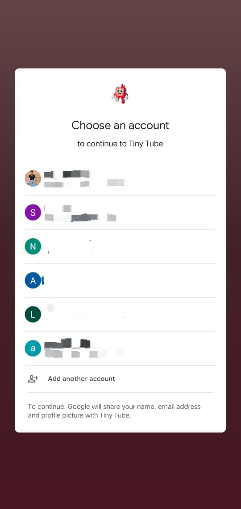
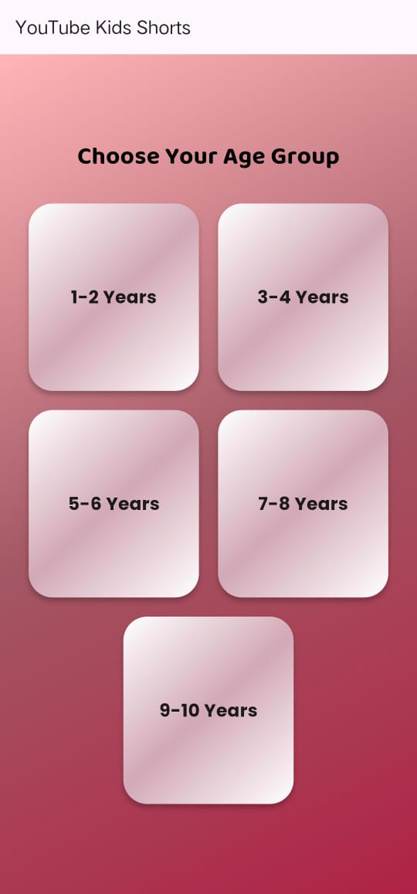

# Tiny Tube – Kids Video App

Tiny Tube is a Flutter mobile app designed for kids to watch safe and age-appropriate videos. It integrates with YouTube’s public library and provides a simple, distraction-free environment for children.

# Features

Google Sign-In – Secure login with Google.

Age Selection – Choose the child’s age to personalize video suggestions.

Safe Content – Videos are fetched from YouTube’s public library with kid-friendly filtering.

Clean & Simple UI – Easy-to-use interface designed especially for kids.

Cross-Platform – Works on both Android and iOS.

# Tech Stack

Framework: Flutter

Language: Dart

Auth: Google Sign-In (Firebase Auth / Google API)

Video Source: YouTube Public API/Library

State Management: Provider / Riverpod / Bloc (depending on your code)

# App Flow

Launch App → User signs in with Google.

Age Selection → User selects age group (e.g., 1-2, 3-4, 5-6,7-8,9-10).

Video Feed → App shows safe, age-appropriate videos from YouTube.

Watch Mode → Kids watch videos in a distraction-free player.

  
  
  
  

